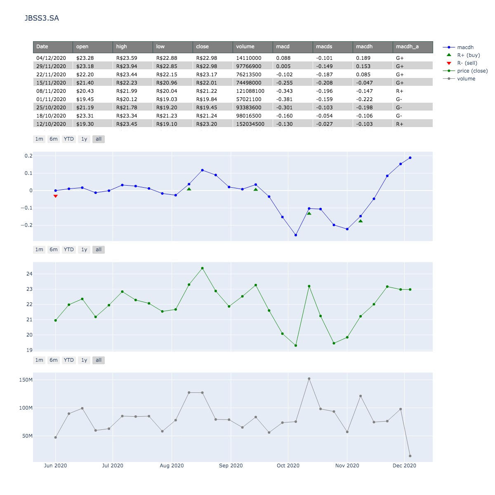
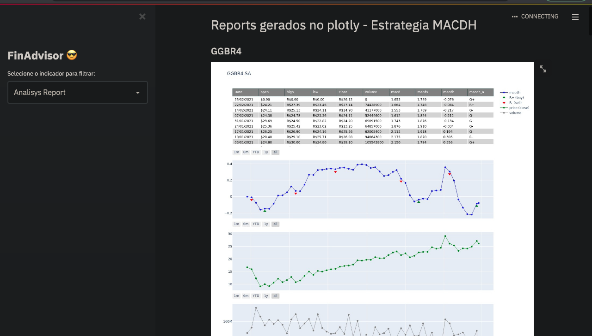

# FinAdvisor

## Table of content <a name = "table-of-content"></a>

- [Description](#description)
- [Features](#features)
- [Requirements](#requirements)
- [Run with Docker Compose](#run-docker-compose)
- [Run with Docker Compose](#run-docker-compose)
- [Installation](#installation)

## Description <a name = "description"></a>

This project was created in 2021 when I was thinking about automating my stock market analysis to know if there was a buy or sell momentum. FinAdvisor is a Python application that automates the analysis of all stocks listed on the Brazilian stock exchange (B3). The bot gathers historical prices for almost all companies listed on the Brazilian Stock Market, applies the MACD analysis, and displays only the stocks with buy or sell recommendations. With this automation, we can analyze all stocks in a minute instead of 2+ hours, making it ideal for investors looking to make informed decisions based on automated analyses.

## Features <a name = "features"></a>

- [X] Data Collection: Gathers financial data of stocks listed on B3.
- [  ] Technical Analysis: Uses indicators such as MACD [X], RSI [  ], Moving Averages[  ], etc.
- [  ] Fundamental Analysis: Considers financial indicators like P/E Ratio [  ], ROE [  ], Dividend Yield [  ], etc.
- [X] Report Generation: Produces reports with buy or sell recommendations.
- [X] Graphical Interface: Uses Streamlit for visualization of analyses.

## Requirements <a name = "requirements"></a>
Python 3.12 or higher (Libraries listed in requirements.txt)
or
Docker Compose

## Run with Docker Compose <a name = "run-docker-compose"></a>

1. Clone the repository:
```
git clone https://github.com/fmaced1/finAdvisor.git
cd finAdvisor
```

2. Start the application
```
docker-compose up --build
```

3. Access the application:
```
Open your web browser and navigate to http://localhost:8501 to view the dashboard.
```

## Installation <a name = "installation"></a>

1. Clone the repository:
```
git clone https://github.com/fmaced1/finAdvisor.git
cd finAdvisor/app
```

2. Create and activate a virtual environment:
```
python3 -m venv venv
source venv/bin/activate  # For Windows use `venv\Scripts\activate`
```

3. Install the required libraries:
```
pip install -r requirements.txt
```

4. Run the application:
```
streamlit run app.py
```

5. Access the application:
```
Open your web browser and navigate to http://localhost:8501 to view the dashboard.
```

#### Analisys Report






#### Contributing
Contributions are welcome! Please follow these steps to contribute:

- Fork the repository.
- Create a new branch (git checkout -b feature/your-feature).
- Commit your changes (git commit -m 'Add new feature').
- Push to the branch (git push origin feature/your-feature).
- Open a Pull Request.

#### License
This project is licensed under the MIT License - see the [LICENSE](LICENSE) file for details.

#### Contact
For any questions or suggestions, feel free to reach out to:

[LinkedIn](https://www.linkedin.com/in/fmaced1/)
[GitHub](https://github.com/fmaced1)
